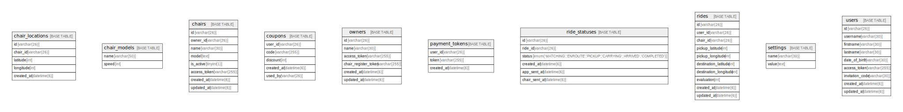

# isuride

## Tables

| Name | Columns | Comment | Type |
| ---- | ------- | ------- | ---- |
| [chair_locations](chair_locations.md) | 5 | 椅子の現在位置情報テーブル | BASE TABLE |
| [chair_models](chair_models.md) | 2 | 椅子モデルテーブル | BASE TABLE |
| [chairs](chairs.md) | 8 | 椅子情報テーブル | BASE TABLE |
| [coupons](coupons.md) | 5 | クーポンテーブル | BASE TABLE |
| [owners](owners.md) | 6 | 椅子のオーナー情報テーブル | BASE TABLE |
| [payment_tokens](payment_tokens.md) | 3 | 決済トークンテーブル | BASE TABLE |
| [ride_statuses](ride_statuses.md) | 6 | ライドステータスの変更履歴テーブル | BASE TABLE |
| [rides](rides.md) | 10 | ライド情報テーブル | BASE TABLE |
| [settings](settings.md) | 2 | システム設定テーブル | BASE TABLE |
| [users](users.md) | 9 | 利用者情報テーブル | BASE TABLE |

## Relations

---

> Generated by [tbls](https://github.com/k1LoW/tbls)
