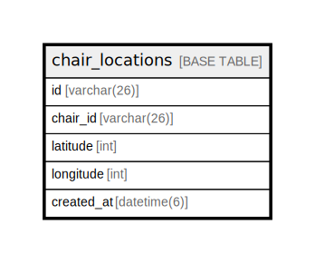

# chair_locations

## Description

椅子の現在位置情報テーブル

<details>
<summary><strong>Table Definition</strong></summary>

```sql
CREATE TABLE `chair_locations` (
  `id` varchar(26) NOT NULL,
  `chair_id` varchar(26) NOT NULL COMMENT '椅子ID',
  `latitude` int NOT NULL COMMENT '経度',
  `longitude` int NOT NULL COMMENT '緯度',
  `created_at` datetime(6) NOT NULL DEFAULT CURRENT_TIMESTAMP(6) COMMENT '登録日時',
  PRIMARY KEY (`id`)
) ENGINE=InnoDB DEFAULT CHARSET=utf8mb4 COLLATE=utf8mb4_0900_ai_ci COMMENT='椅子の現在位置情報テーブル'
```

</details>

## Columns

| Name | Type | Default | Nullable | Extra Definition | Children | Parents | Comment |
| ---- | ---- | ------- | -------- | ---------------- | -------- | ------- | ------- |
| id | varchar(26) |  | false |  |  |  |  |
| chair_id | varchar(26) |  | false |  |  |  | 椅子ID |
| latitude | int |  | false |  |  |  | 経度 |
| longitude | int |  | false |  |  |  | 緯度 |
| created_at | datetime(6) | CURRENT_TIMESTAMP(6) | false | DEFAULT_GENERATED |  |  | 登録日時 |

## Constraints

| Name | Type | Definition |
| ---- | ---- | ---------- |
| PRIMARY | PRIMARY KEY | PRIMARY KEY (id) |

## Indexes

| Name | Definition |
| ---- | ---------- |
| PRIMARY | PRIMARY KEY (id) USING BTREE |

## Relations



---

> Generated by [tbls](https://github.com/k1LoW/tbls)
