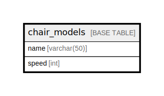

# chair_models

## Description

椅子モデルテーブル

<details>
<summary><strong>Table Definition</strong></summary>

```sql
CREATE TABLE `chair_models` (
  `name` varchar(50) NOT NULL COMMENT '椅子モデル名',
  `speed` int NOT NULL COMMENT '移動速度',
  PRIMARY KEY (`name`)
) ENGINE=InnoDB DEFAULT CHARSET=utf8mb4 COLLATE=utf8mb4_0900_ai_ci COMMENT='椅子モデルテーブル'
```

</details>

## Columns

| Name | Type | Default | Nullable | Children | Parents | Comment |
| ---- | ---- | ------- | -------- | -------- | ------- | ------- |
| name | varchar(50) |  | false |  |  | 椅子モデル名 |
| speed | int |  | false |  |  | 移動速度 |

## Constraints

| Name | Type | Definition |
| ---- | ---- | ---------- |
| PRIMARY | PRIMARY KEY | PRIMARY KEY (name) |

## Indexes

| Name | Definition |
| ---- | ---------- |
| PRIMARY | PRIMARY KEY (name) USING BTREE |

## Relations



---

> Generated by [tbls](https://github.com/k1LoW/tbls)
