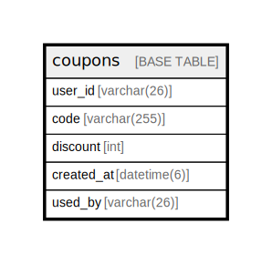

# coupons

## Description

クーポンテーブル

<details>
<summary><strong>Table Definition</strong></summary>

```sql
CREATE TABLE `coupons` (
  `user_id` varchar(26) NOT NULL COMMENT '所有しているユーザーのID',
  `code` varchar(255) NOT NULL COMMENT 'クーポンコード',
  `discount` int NOT NULL COMMENT '割引額',
  `created_at` datetime(6) NOT NULL DEFAULT CURRENT_TIMESTAMP(6) COMMENT '付与日時',
  `used_by` varchar(26) DEFAULT NULL COMMENT 'クーポンが適用されたライドのID',
  PRIMARY KEY (`user_id`,`code`)
) ENGINE=InnoDB DEFAULT CHARSET=utf8mb4 COLLATE=utf8mb4_0900_ai_ci COMMENT='クーポンテーブル'
```

</details>

## Columns

| Name | Type | Default | Nullable | Extra Definition | Children | Parents | Comment |
| ---- | ---- | ------- | -------- | ---------------- | -------- | ------- | ------- |
| user_id | varchar(26) |  | false |  |  |  | 所有しているユーザーのID |
| code | varchar(255) |  | false |  |  |  | クーポンコード |
| discount | int |  | false |  |  |  | 割引額 |
| created_at | datetime(6) | CURRENT_TIMESTAMP(6) | false | DEFAULT_GENERATED |  |  | 付与日時 |
| used_by | varchar(26) |  | true |  |  |  | クーポンが適用されたライドのID |

## Constraints

| Name | Type | Definition |
| ---- | ---- | ---------- |
| PRIMARY | PRIMARY KEY | PRIMARY KEY (user_id, code) |

## Indexes

| Name | Definition |
| ---- | ---------- |
| PRIMARY | PRIMARY KEY (user_id, code) USING BTREE |

## Relations



---

> Generated by [tbls](https://github.com/k1LoW/tbls)
