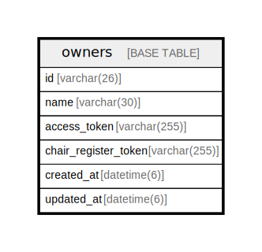

# owners

## Description

椅子のオーナー情報テーブル

<details>
<summary><strong>Table Definition</strong></summary>

```sql
CREATE TABLE `owners` (
  `id` varchar(26) NOT NULL COMMENT 'オーナーID',
  `name` varchar(30) NOT NULL COMMENT 'オーナー名',
  `access_token` varchar(255) NOT NULL COMMENT 'アクセストークン',
  `chair_register_token` varchar(255) NOT NULL COMMENT '椅子登録トークン',
  `created_at` datetime(6) NOT NULL DEFAULT CURRENT_TIMESTAMP(6) COMMENT '登録日時',
  `updated_at` datetime(6) NOT NULL DEFAULT CURRENT_TIMESTAMP(6) ON UPDATE CURRENT_TIMESTAMP(6) COMMENT '更新日時',
  PRIMARY KEY (`id`),
  UNIQUE KEY `name` (`name`),
  UNIQUE KEY `access_token` (`access_token`),
  UNIQUE KEY `chair_register_token` (`chair_register_token`)
) ENGINE=InnoDB DEFAULT CHARSET=utf8mb4 COLLATE=utf8mb4_0900_ai_ci COMMENT='椅子のオーナー情報テーブル'
```

</details>

## Columns

| Name | Type | Default | Nullable | Extra Definition | Children | Parents | Comment |
| ---- | ---- | ------- | -------- | ---------------- | -------- | ------- | ------- |
| id | varchar(26) |  | false |  |  |  | オーナーID |
| name | varchar(30) |  | false |  |  |  | オーナー名 |
| access_token | varchar(255) |  | false |  |  |  | アクセストークン |
| chair_register_token | varchar(255) |  | false |  |  |  | 椅子登録トークン |
| created_at | datetime(6) | CURRENT_TIMESTAMP(6) | false | DEFAULT_GENERATED |  |  | 登録日時 |
| updated_at | datetime(6) | CURRENT_TIMESTAMP(6) | false | DEFAULT_GENERATED on update CURRENT_TIMESTAMP(6) |  |  | 更新日時 |

## Constraints

| Name | Type | Definition |
| ---- | ---- | ---------- |
| access_token | UNIQUE | UNIQUE KEY access_token (access_token) |
| chair_register_token | UNIQUE | UNIQUE KEY chair_register_token (chair_register_token) |
| name | UNIQUE | UNIQUE KEY name (name) |
| PRIMARY | PRIMARY KEY | PRIMARY KEY (id) |

## Indexes

| Name | Definition |
| ---- | ---------- |
| PRIMARY | PRIMARY KEY (id) USING BTREE |
| access_token | UNIQUE KEY access_token (access_token) USING BTREE |
| chair_register_token | UNIQUE KEY chair_register_token (chair_register_token) USING BTREE |
| name | UNIQUE KEY name (name) USING BTREE |

## Relations



---

> Generated by [tbls](https://github.com/k1LoW/tbls)
