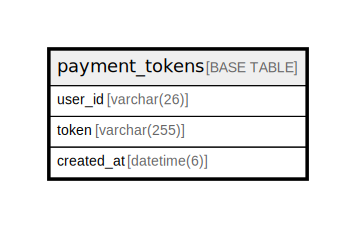

# payment_tokens

## Description

決済トークンテーブル

<details>
<summary><strong>Table Definition</strong></summary>

```sql
CREATE TABLE `payment_tokens` (
  `user_id` varchar(26) NOT NULL COMMENT 'ユーザーID',
  `token` varchar(255) NOT NULL COMMENT '決済トークン',
  `created_at` datetime(6) NOT NULL DEFAULT CURRENT_TIMESTAMP(6) COMMENT '登録日時',
  PRIMARY KEY (`user_id`)
) ENGINE=InnoDB DEFAULT CHARSET=utf8mb4 COLLATE=utf8mb4_0900_ai_ci COMMENT='決済トークンテーブル'
```

</details>

## Columns

| Name | Type | Default | Nullable | Extra Definition | Children | Parents | Comment |
| ---- | ---- | ------- | -------- | ---------------- | -------- | ------- | ------- |
| user_id | varchar(26) |  | false |  |  |  | ユーザーID |
| token | varchar(255) |  | false |  |  |  | 決済トークン |
| created_at | datetime(6) | CURRENT_TIMESTAMP(6) | false | DEFAULT_GENERATED |  |  | 登録日時 |

## Constraints

| Name | Type | Definition |
| ---- | ---- | ---------- |
| PRIMARY | PRIMARY KEY | PRIMARY KEY (user_id) |

## Indexes

| Name | Definition |
| ---- | ---------- |
| PRIMARY | PRIMARY KEY (user_id) USING BTREE |

## Relations



---

> Generated by [tbls](https://github.com/k1LoW/tbls)
