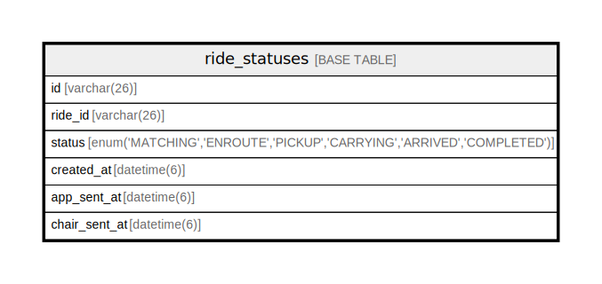

# ride_statuses

## Description

ライドステータスの変更履歴テーブル

<details>
<summary><strong>Table Definition</strong></summary>

```sql
CREATE TABLE `ride_statuses` (
  `id` varchar(26) NOT NULL,
  `ride_id` varchar(26) NOT NULL COMMENT 'ライドID',
  `status` enum('MATCHING','ENROUTE','PICKUP','CARRYING','ARRIVED','COMPLETED') NOT NULL COMMENT '状態',
  `created_at` datetime(6) NOT NULL DEFAULT CURRENT_TIMESTAMP(6) COMMENT '状態変更日時',
  `app_sent_at` datetime(6) DEFAULT NULL COMMENT 'ユーザーへの状態通知日時',
  `chair_sent_at` datetime(6) DEFAULT NULL COMMENT '椅子への状態通知日時',
  PRIMARY KEY (`id`)
) ENGINE=InnoDB DEFAULT CHARSET=utf8mb4 COLLATE=utf8mb4_0900_ai_ci COMMENT='ライドステータスの変更履歴テーブル'
```

</details>

## Columns

| Name | Type | Default | Nullable | Extra Definition | Children | Parents | Comment |
| ---- | ---- | ------- | -------- | ---------------- | -------- | ------- | ------- |
| id | varchar(26) |  | false |  |  |  |  |
| ride_id | varchar(26) |  | false |  |  |  | ライドID |
| status | enum('MATCHING','ENROUTE','PICKUP','CARRYING','ARRIVED','COMPLETED') |  | false |  |  |  | 状態 |
| created_at | datetime(6) | CURRENT_TIMESTAMP(6) | false | DEFAULT_GENERATED |  |  | 状態変更日時 |
| app_sent_at | datetime(6) |  | true |  |  |  | ユーザーへの状態通知日時 |
| chair_sent_at | datetime(6) |  | true |  |  |  | 椅子への状態通知日時 |

## Constraints

| Name | Type | Definition |
| ---- | ---- | ---------- |
| PRIMARY | PRIMARY KEY | PRIMARY KEY (id) |

## Indexes

| Name | Definition |
| ---- | ---------- |
| PRIMARY | PRIMARY KEY (id) USING BTREE |

## Relations



---

> Generated by [tbls](https://github.com/k1LoW/tbls)
