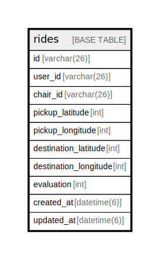

# rides

## Description

ライド情報テーブル

<details>
<summary><strong>Table Definition</strong></summary>

```sql
CREATE TABLE `rides` (
  `id` varchar(26) NOT NULL COMMENT 'ライドID',
  `user_id` varchar(26) NOT NULL COMMENT 'ユーザーID',
  `chair_id` varchar(26) DEFAULT NULL COMMENT '割り当てられた椅子ID',
  `pickup_latitude` int NOT NULL COMMENT '配車位置(経度)',
  `pickup_longitude` int NOT NULL COMMENT '配車位置(緯度)',
  `destination_latitude` int NOT NULL COMMENT '目的地(経度)',
  `destination_longitude` int NOT NULL COMMENT '目的地(緯度)',
  `evaluation` int DEFAULT NULL COMMENT '評価',
  `created_at` datetime(6) NOT NULL DEFAULT CURRENT_TIMESTAMP(6) COMMENT '要求日時',
  `updated_at` datetime(6) NOT NULL DEFAULT CURRENT_TIMESTAMP(6) ON UPDATE CURRENT_TIMESTAMP(6) COMMENT '状態更新日時',
  PRIMARY KEY (`id`)
) ENGINE=InnoDB DEFAULT CHARSET=utf8mb4 COLLATE=utf8mb4_0900_ai_ci COMMENT='ライド情報テーブル'
```

</details>

## Columns

| Name | Type | Default | Nullable | Extra Definition | Children | Parents | Comment |
| ---- | ---- | ------- | -------- | ---------------- | -------- | ------- | ------- |
| id | varchar(26) |  | false |  |  |  | ライドID |
| user_id | varchar(26) |  | false |  |  |  | ユーザーID |
| chair_id | varchar(26) |  | true |  |  |  | 割り当てられた椅子ID |
| pickup_latitude | int |  | false |  |  |  | 配車位置(経度) |
| pickup_longitude | int |  | false |  |  |  | 配車位置(緯度) |
| destination_latitude | int |  | false |  |  |  | 目的地(経度) |
| destination_longitude | int |  | false |  |  |  | 目的地(緯度) |
| evaluation | int |  | true |  |  |  | 評価 |
| created_at | datetime(6) | CURRENT_TIMESTAMP(6) | false | DEFAULT_GENERATED |  |  | 要求日時 |
| updated_at | datetime(6) | CURRENT_TIMESTAMP(6) | false | DEFAULT_GENERATED on update CURRENT_TIMESTAMP(6) |  |  | 状態更新日時 |

## Constraints

| Name | Type | Definition |
| ---- | ---- | ---------- |
| PRIMARY | PRIMARY KEY | PRIMARY KEY (id) |

## Indexes

| Name | Definition |
| ---- | ---------- |
| PRIMARY | PRIMARY KEY (id) USING BTREE |

## Relations



---

> Generated by [tbls](https://github.com/k1LoW/tbls)
