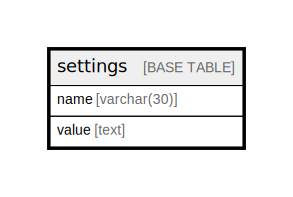

# settings

## Description

システム設定テーブル

<details>
<summary><strong>Table Definition</strong></summary>

```sql
CREATE TABLE `settings` (
  `name` varchar(30) NOT NULL COMMENT '設定名',
  `value` text NOT NULL COMMENT '設定値',
  PRIMARY KEY (`name`)
) ENGINE=InnoDB DEFAULT CHARSET=utf8mb4 COLLATE=utf8mb4_0900_ai_ci COMMENT='システム設定テーブル'
```

</details>

## Columns

| Name | Type | Default | Nullable | Children | Parents | Comment |
| ---- | ---- | ------- | -------- | -------- | ------- | ------- |
| name | varchar(30) |  | false |  |  | 設定名 |
| value | text |  | false |  |  | 設定値 |

## Constraints

| Name | Type | Definition |
| ---- | ---- | ---------- |
| PRIMARY | PRIMARY KEY | PRIMARY KEY (name) |

## Indexes

| Name | Definition |
| ---- | ---------- |
| PRIMARY | PRIMARY KEY (name) USING BTREE |

## Relations



---

> Generated by [tbls](https://github.com/k1LoW/tbls)
