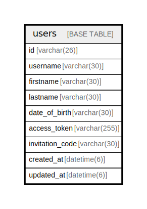

# users

## Description

利用者情報テーブル

<details>
<summary><strong>Table Definition</strong></summary>

```sql
CREATE TABLE `users` (
  `id` varchar(26) NOT NULL COMMENT 'ユーザーID',
  `username` varchar(30) NOT NULL COMMENT 'ユーザー名',
  `firstname` varchar(30) NOT NULL COMMENT '本名(名前)',
  `lastname` varchar(30) NOT NULL COMMENT '本名(名字)',
  `date_of_birth` varchar(30) NOT NULL COMMENT '生年月日',
  `access_token` varchar(255) NOT NULL COMMENT 'アクセストークン',
  `invitation_code` varchar(30) NOT NULL COMMENT '招待トークン',
  `created_at` datetime(6) NOT NULL DEFAULT CURRENT_TIMESTAMP(6) COMMENT '登録日時',
  `updated_at` datetime(6) NOT NULL DEFAULT CURRENT_TIMESTAMP(6) ON UPDATE CURRENT_TIMESTAMP(6) COMMENT '更新日時',
  PRIMARY KEY (`id`),
  UNIQUE KEY `username` (`username`),
  UNIQUE KEY `access_token` (`access_token`),
  UNIQUE KEY `invitation_code` (`invitation_code`)
) ENGINE=InnoDB DEFAULT CHARSET=utf8mb4 COLLATE=utf8mb4_0900_ai_ci COMMENT='利用者情報テーブル'
```

</details>

## Columns

| Name | Type | Default | Nullable | Extra Definition | Children | Parents | Comment |
| ---- | ---- | ------- | -------- | ---------------- | -------- | ------- | ------- |
| id | varchar(26) |  | false |  |  |  | ユーザーID |
| username | varchar(30) |  | false |  |  |  | ユーザー名 |
| firstname | varchar(30) |  | false |  |  |  | 本名(名前) |
| lastname | varchar(30) |  | false |  |  |  | 本名(名字) |
| date_of_birth | varchar(30) |  | false |  |  |  | 生年月日 |
| access_token | varchar(255) |  | false |  |  |  | アクセストークン |
| invitation_code | varchar(30) |  | false |  |  |  | 招待トークン |
| created_at | datetime(6) | CURRENT_TIMESTAMP(6) | false | DEFAULT_GENERATED |  |  | 登録日時 |
| updated_at | datetime(6) | CURRENT_TIMESTAMP(6) | false | DEFAULT_GENERATED on update CURRENT_TIMESTAMP(6) |  |  | 更新日時 |

## Constraints

| Name | Type | Definition |
| ---- | ---- | ---------- |
| access_token | UNIQUE | UNIQUE KEY access_token (access_token) |
| invitation_code | UNIQUE | UNIQUE KEY invitation_code (invitation_code) |
| PRIMARY | PRIMARY KEY | PRIMARY KEY (id) |
| username | UNIQUE | UNIQUE KEY username (username) |

## Indexes

| Name | Definition |
| ---- | ---------- |
| PRIMARY | PRIMARY KEY (id) USING BTREE |
| access_token | UNIQUE KEY access_token (access_token) USING BTREE |
| invitation_code | UNIQUE KEY invitation_code (invitation_code) USING BTREE |
| username | UNIQUE KEY username (username) USING BTREE |

## Relations



---

> Generated by [tbls](https://github.com/k1LoW/tbls)
